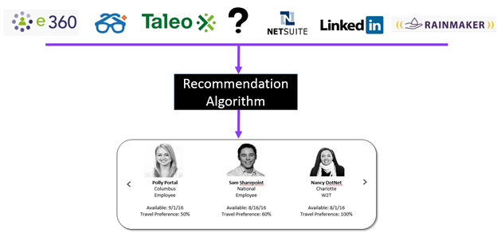
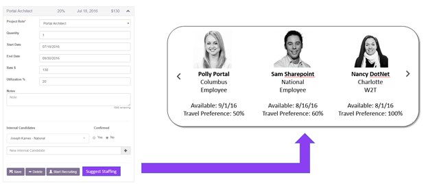

**Concept: Smart Staffing Engine**

Carmen Fontana

 

**Hypothesis**

 

*In a professional services organization, we can improve overall utilization and reduce dependency on recruiting by using aggregated workforce data to produce machine generated staffing suggestions.*

 

**Background: Staffing in a Professional Services Organization**

 

In a professional services organization, the vast majority of expenses are tied to non-billable staff hours ("bench time"). By reducing bench time, companies can increase profitability.

 

Therefore, it is preferable to staff new projects with benched resources versus hiring new employees. Additionally, there is an associated hiring cost for a new employee. (In the consulting industry, this cost averages $4300/hire)

 

The traditional staffing scenario relies heavily on what we will call "Boolean" decision making. A Resource Manager will match the particulars of an upcoming project (such as start date, bill rate, and location) against a database of available resources. A typical search query can be performed by a computer or more simply in the Resource Manager’s head. Either way, a typical search would be something like this:

 

*List employees that are available for a new project June 1, have a cost rate of less than $50 per hour and are classified as an Organizational Change Management Senior Consultant*.

 

There are several challenges with this model:

* **Scalability** - As an organization grows, it is difficult to have deep knowledge of all team members’ skills and preferences. This is particularly difficult to do if staffing is managed via spreadsheets. However, even if a database is employed, a search query for "employees with java experience" could yield hundreds, if not thousands, of results. There is just too much information for a human to synthesize in a thoughtful manner.

* **Adjustable Parameters **- Rarely are the particulars of a project (such as start date) rigid. Parameters adjust regularly based on client and staffing conditions. Staffing is much more grey than it is black and white.

* **Bias** - Despite our best intentions, our human nature causes us to make biased decisions. For example, in staffing that may mean a tendency to gravitate towards resources we have familiarity versus a more qualified stranger.

* **Data Scarcity** - As the mantra goes, garbage in, garbage out. Manually updating skills databases is a difficult, and never-ending, task. Thus, data is often incomplete or even missing. Without good data, decision making is less effective.

 

** **

**Smart Staffing Tool**

 

**Inspiration**

** **

 

Organizations like Netflix, Amazon and Spotify, use recommendation engines to curate content to an individual user. By providing personalized recommendations, these sites increase customer satisfaction which ultimately drives revenue.

 

The technical complexities of these consumer-facing recommendation engines are beyond the scope of this document. In the simplest terms, they observe, record and learn user behavior which allows them to continually tune their recommendation algorithms. These algorithms, obviously, are much more complex than a simple AND OR statement.

 

In can thus be inferred that these companies feel that recommendation process is superior to basic Boolean matching. So why is the staffing of people, which is even more nuanced than product or content, still relying on this matching methodology? Can we become smarter at professional services staffing by using some of the same strategies that e-commerce companies incorporate?

 

**Design**

 

 

The foundation of our Smart Staffing Engine is aggregated data from both internal and external sources. By combining things like past project data with employee training history with external social media cues, we can build a comprehensive view of an employee’s skill set, professional interests, and work preferences.

 

An additional benefit of leveraging many different data sources is that it reduces the points of failure. If one source of data is scarce or missing (for example, there is not a role defined for the employee in e360), there are other data sources that can fill in the blanks.

 

Among the data sets we can leverage:

* Rainmaker

* E360

* Taleo

* LinkedIn

* NetSuite

* Degreed

 

This data provides a foundation for the staffing algorithms to learn and build recommendations.

 

Next, comes the recommendation layer. Using the signals produced from the aggregated data set, the algorithm will learn what type of employee works best for certain projects and make recommendations accordingly.

 

If the algorithm were a real-life human Resource Manager, the questions it may ask about potential resources* may include:

* *Have they been proposed for similar roles?*

* *Has the resource done training in this area?*

* *What is their historical utilization in this role?*

* *Have they worked in similar roles, either at Centric or a former employer?*

* *Do users typically view this person’s profile for this type of role?*

* *Is this person available in the general timeframe I need?*

* *Are the employee’s costs generally in line with my project’s requirements?*

* *John Doe is perfect for this project but not available. Who are people in our organization like John Doe that are available?*

**Resource = Employee, Contractor or Candidate*

 

Not all answers would be weighted the same, and adjustments would be made over time to optimize the recommendation algorithm.

In a practical sense, we could see the Smart Staffing Engine plugging into existing software. In Centric’s case, it could tie to Rainmaker. An Account Manager could click on the "Suggest Staffing" button, and multiple staffing suggestions are displayed. The Account Manager could then review the recommendations and click through to an employee’s profile or request additional suggestions.

 

** **

** **

**Build Out Phases**

We anticipate building out the Smart Staffing Engine in phases.

Implementing Phase 1 and 2 would allow users to access a minimum viable product expediently and prove out the concept. Phase 2 (basic recommendation algorithm) will be conducted using a smaller data set comprised of 1-2 Service Offering’s project histories.

 

*Phase 0:* Current State

*Phase 1:* Aggregating basic data sources (Rainmaker, e360, Project Workbench, LinkedIn)

*Phase 2:* Implementation of basic recommendation algorithm using Machine Learning on a small data set

*Phase 3:* Development of recommendation interface.

*Phase 4:*  Implementation of more advanced recommendation algorithm using Machine Learning on larger data set

*Phase 5:* Aggregating additional data sources (such as Degreed, Taleo, NetSuites)

*Phase 6:* Implementation of extended recommendation algorithm using Machine Learning

 

**Technology and Resource Requirements**

TBD - Likely to be built on Azure platform

UI - Angular 2, Typescript

**Team**

The team is currently comprised of eight people spanning multiple operating groups:

* Shared Services - Carmen Fontana, Marc Johnson

* PEX SO - Tom Ujvagi, Hitanshu Pande

* D&A SO - Jeff Kanel

* Cincinnati BU - John Quinn

* EAS BU - Derek Polishen

* Insurance IV - Michael Hartman

* **Product Owner (Carmen Fontana)** - Responsible for overall feature decisions and direction of the product, final decisions on scoping the various releases

* **Service Offering Leadership (Tom Ujvagi and Jeff Kanel)** - Responsible for taking project extract and applying additional tagging to the roles people played on the project over and above the "vanilla" role data we already have, helping us assess results of our first test to apply new Opportunities in the Pipeline to the recommendation results, if successful help us build business case

* **Tech Lead (Marc Johnson)** - Coordinating with Product owner and tech folks, helping to provide long term tech direction to productize the work we are doing out of the gate

* **Integration Developer (1-3 people: Marc Johnson, John Quinn, Derek Polishen) **- Responsible for the following for each data source they are researching: understanding authentication, working with Product owner to understand data elements needed for MVP and beyond, understand capabilities of the API and format of the data being returned, work with Data & Analytics team to get data into a format that they can consume for machine learning

    * Highest priority for initial tests

        * Data coming from e360 and Project Workbench (Marc)

        * Resume data coming from Centricity (John)

        * LinkedIn (Derek)

    * Longer term priorities (can go in parallel with higher priorities)

        * Taleo

        * Netsuite

        * Rainmaker

        * Degreed

* **Machine Learning Specialists (1-2 people: Hitanshu Pande, Michael Hartman) **- Responsible for laying out the format that they would like the data in to be fed into the Azure Machine Learning services, applying Azure Machine Learning services to that data to generate recommendations

* **UI Developer (1-2 people: Ben Millhouse, ?) **- Responsible for building the Web UI, the front end for the smart staffing recommendations

 

**Evaluating Performance (Hypothesis)**

At first blush, company utilization appears to be a good metric for evaluating the effectiveness of the Smart Staffing Engine. If utilization is going up it must be working, right? Maybe, maybe not. Maybe it is helping staff better. Or maybe the bench workforce was reduced, artificially inflating the utilization numbers. Another scenario where utilization alone can be misleading is if sales decline. If there are less projects to staff people to, utilization will go undoubtedly go down, no matter how smart your staffing algorithm.

Thus, it is important to monitor utilization in tandem with the percentage of projects that are being staffed by the existing workforce ("self-staffed").

If the Smart Staffing Engine is succeeding, both utilization AND self-staffed percentage will increase.

If the Smart Staffing Engine is not succeeding, both utilization AND self-staffed percentage will decrease.

If utilization increases and self-staffed percentage decreases (or vice versa), there are likely other factors at play (such as low sales or excessive hiring) and no conclusion can be drawn.

In addition, these other factors that can be used to evaluate performance:

* Reduction in the time required for Resource Managers to staff projects

* Speed of staffing projects

* User satisfaction with the Smart Staffing Engine

We recommend tracking these metrics on a monthly basis with decision points every six months. If the Smart Staffing Engine is succeeding at the decision point, the project will move onto the next phase.

For the prototype phase, we are simply asking ourselves:

*"Can machine learning identify resources for **past** projects that humans could not?"*

If so, it can be extrapolated that machine learning can help identify resources for future projects that humans can not.

